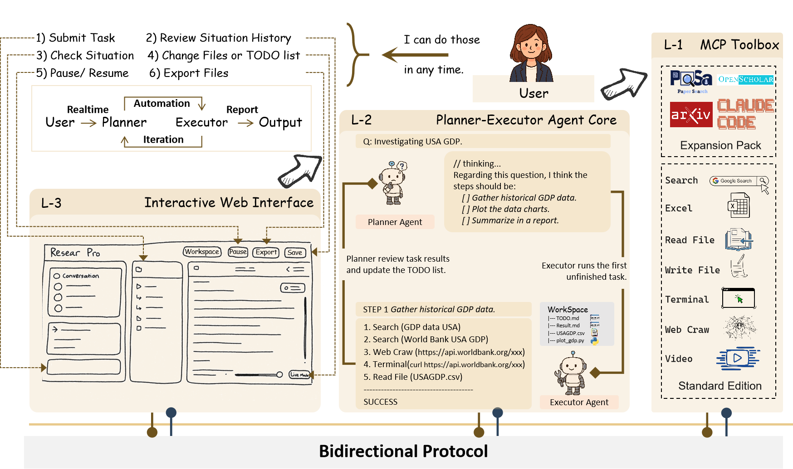
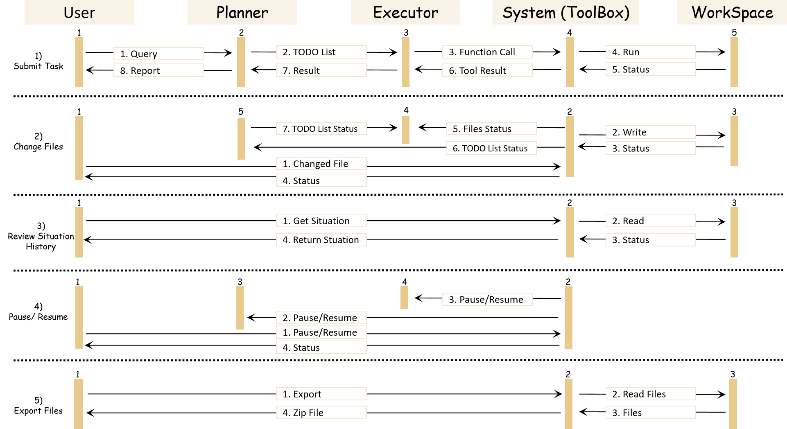
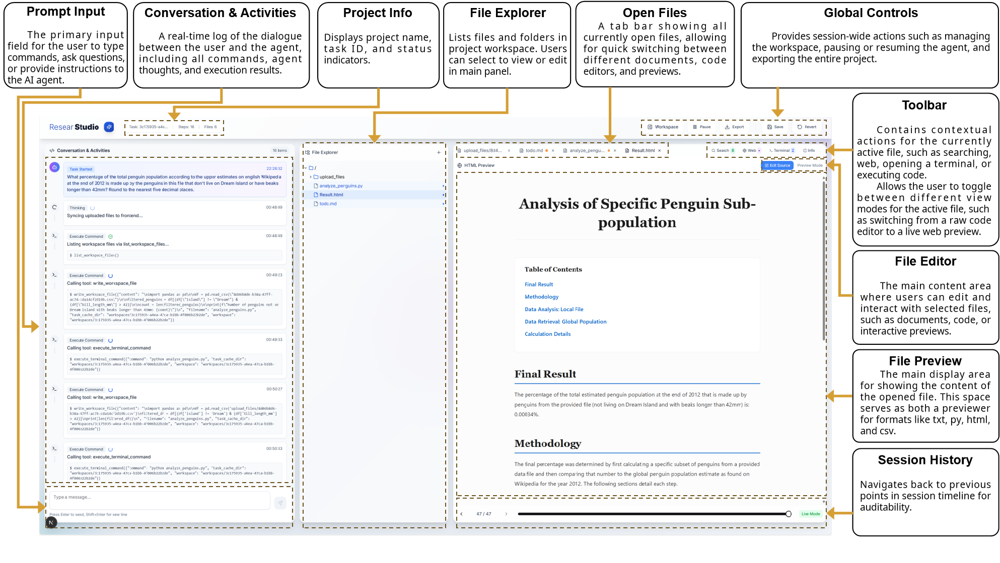

```
 ____                           ____  _             _ _       
|  _ \ ___  ___  ___  __ _ _ __/ ___|| |_ _   _  __| (_) ___  
| |_) / _ \/ __|/ _ \/ _` | '__\___ \| __| | | |/ _` | |/ _ \ 
|  _ <  __/\__ \  __/ (_| | |   ___) | |_| |_| | (_| | | (_) |
|_| \_\___||___/\___|\__,_|_|  |____/ \__|\__,_|\__,_|_|\___/ 
                                                               
```

# ResearStudio - Human-Intervenable Deep Research Framework

[](https://opensource.org/licenses/MIT)
[](https://www.python.org/downloads/)
[](https://nodejs.org/)

**ResearStudio** is the first open-source framework for building human-intervenable deep research agents. It enables real-time collaboration between humans and AI, allowing users to pause, edit, and guide AI agents during execution rather than operating in a traditional "fire-and-forget" mode.



## 🌟 Key Features

- **🤝 Real-time Human-AI Collaboration**: Pause, edit, and resume agent execution at any time
- **📊 Multi-Agent Architecture**: Hierarchical Planner-Executor system with specialized tools
- **🔧 Comprehensive Tool Suite**: Search, code execution, document processing, and more
- **🌐 Web-based Interface**: Modern React/Next.js frontend with real-time updates
- **📝 Plan-as-Document**: All agent plans are visible and editable in real-time
- **🔒 Sandboxed Execution**: Safe, isolated environments for code execution
- **🚀 State-of-the-art Performance**: Achieves 70.91% on GAIA benchmark

## 🏗️ Architecture

ResearStudio follows a three-layer architecture:

1. **L-1 Tool Layer**: MCP-based tool suite (search, code, documents, etc.)
2. **L-2 Agent Core**: Planner (GPT-4) and Executor (GPT-4o-mini/o3) 
3. **L-3 Interface Layer**: React/Next.js web interface with SSE streaming



```
┌─────────────────────────────────────────┐
│          L-3: Web Interface             │
│         (Next.js + React 19)            │
└────────────────┬────────────────────────┘
                 │ SSE/WebSocket
┌────────────────▼────────────────────────┐
│          L-2: Agent Core                │
│   ┌──────────┐     ┌──────────┐        │
│   │ Planner  │────▶│ Executor │        │
│   └──────────┘     └──────────┘        │
└────────────────┬────────────────────────┘
                 │ MCP Protocol
┌────────────────▼────────────────────────┐
│          L-1: Tool Layer                │
│  Search │ Code │ Docs │ Video │ Image   │
└─────────────────────────────────────────┘
```

## 🚀 Quick Start

### Prerequisites

- Python 3.8+
- Node.js 18+
- OpenAI API key
- Git

### Installation

#### Quick Install (Recommended)

```bash
# Clone the repository
git clone https://github.com/ResearAI/ResearStudio.git
cd ResearStudio

# Run the one-click installer
./setup.sh

# Add your OpenAI API key
nano agent/.env  # Add your API key
```

#### Manual Installation

```bash
# Install Python dependencies
pip install -r requirements.txt

# Install frontend dependencies
cd frontend
npm install --legacy-peer-deps
cd ..

# Set up environment variables
cp agent/.env.example agent/.env
cp frontend/.env.example frontend/.env.local
# Edit the .env files with your API keys
```

### Running the Application

#### Quick Start

```bash
# Start both backend and frontend
./start.sh

# Access the application at http://localhost:3000

# To stop the application
./stop.sh
```

#### Manual Start

```bash
# Terminal 1: Start the backend
cd agent
python app.py

# Terminal 2: Start the frontend
cd frontend
npm run dev

# Access at http://localhost:3000
```

## 📖 Documentation

- [Installation Guide](./INSTALL.md) - Detailed installation instructions
- [Developer Guide](./DEVELOPER.md) - Guide for extending and modifying the system
- [API Documentation](./API.md) - Complete API reference
- [Blog Tutorial](./BLOG_TUTORIAL.md) - Step-by-step tutorial

## 🎯 Use Cases

- **Research Automation**: Automate literature reviews and data analysis
- **Code Development**: AI-assisted programming with human oversight
- **Data Processing**: Process documents, videos, and images with AI
- **Complex Problem Solving**: Tackle multi-step problems with human guidance



## 🧪 Performance

ResearStudio achieves state-of-the-art results on the GAIA benchmark:

| Level | Score |
|-------|-------|
| Level-1 | 77.36% |
| Level-2 | 69.77% |
| Level-3 | 61.54% |
| **Average** | **70.91%** |

## 🤝 Contributing

We welcome contributions! Please see our [Contributing Guide](./CONTRIBUTING.md) for details.

## 📄 License

This project is licensed under the MIT License - see the [LICENSE](./LICENSE) file for details.

## 📚 Citation

If you use ResearStudio in your research, please cite:

```bibtex
@article{yang2025researstudio,
  title={ResearStudio: A Human-Intervenable Framework for Building Controllable Deep-Research Agents},
  author={Yang, Linyi and Weng, Yixuan},
  year={2025}
}
```

## 🙏 Acknowledgments

- OpenAI for GPT models
- The GAIA benchmark team
- All contributors and users

## 📬 Contact

- Email: resear.ai@gmail.com
- Issues: [GitHub Issues](https://github.com/ResearAI/ResearStudio/issues)

## 🔗 Links

- [Live Demo](http://ai-researcher.net:3000/)
- [Paper](https://arxiv.org/abs/your-paper-id)
- [GitHub Repository](https://github.com/ResearAI/ResearStudio)